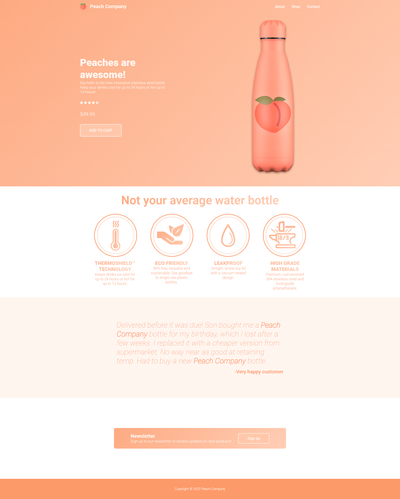

# The Odin Project - Landing Page Challenge

## Table of contents

- [The challenge](#the-challenge)
- [Screenshot](#screenshot)
- [Links](#links)
- [Built with](#built-with)

### The challenge

Users should be able to:

- Create a landing page with the design provided by TheOdinProject

### Screenshot

### Links

- Live Site URL: [Live Site](https://domdev98.github.io/custom-odin-landing-page/)

### Built with

- Semantic HTML5 markup
- CSS custom properties
- Flexbox